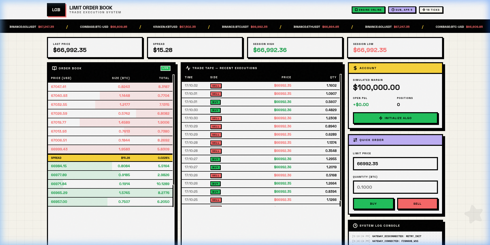
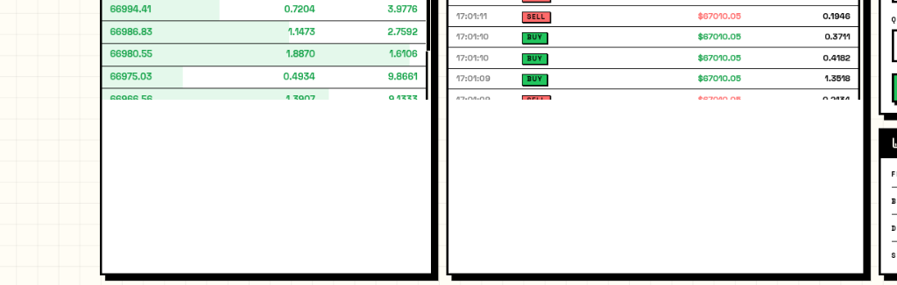

# Limit Order Book & Trade Execution System 

A professional, high-frequency trading (HFT) dashboard built with a Neo-brutalist design aesthetic. This system provides a real-time visualization of market liquidity, specialized trade execution tools, and a live data pipeline from the Binance market feed via Finnhub.

### Dashboard Preview


### Database Architecture


[View Interactive ERD on dbdiagram.io](https://dbdiagram.io/d/Limit-Order-Book-and-Trade-Execution-System-69d2531f0f7c9ef2c08090ca)

## Quick Start

### 1. Prerequisites
- Python 3.9+
- Node.js 18+
- Finnhub API Key (Add to `backend/.env` as `FINNHUB_API_KEY=YOUR_KEY`)

### 2. Launch the Backend (FastAPI)
```bash
cd backend
python -m uvicorn main:app --reload --port 8000
```
- **API Docs**: [http://127.0.0.1:8000/docs](http://127.0.0.1:8000/docs)
- **WebSocket Gateway**: `ws://127.0.0.1:8000/ws/market`

### 3. Launch the Frontend (React + Vite)
```bash
cd frontend
npm install
npm run dev
```
- **Terminal Access**: [http://localhost:5173/](http://localhost:5173/)

### Quick Example: Executing a Trade

To verify the dynamic data flow and responsive execution logic:

1.  **Set Price**: The **Limit Price** field in the 'Quick Order' panel auto-fills with the most recent ticker.
2.  **Set Qty**: Enter a value like `0.5000` in the **Quantity (BTC)** field.
3.  **Execute**: Click the green **BUY** or red **SELL** button.
4.  **Confirm**: 
    - The **System Log Console** will record `ORDER_EXECUTED: [SIDE] [QTY] @ [PRICE]`.
    - A new entry will instantly appear at the top of the **Trade Tape**.

---

## Key Features

- **Neo-Brutalist UI**: High-contrast, bold design utilizing thick black borders, hard shadows, and the **Space Grotesk** typeface.
- **Dynamic Order Book**: Real-time bid/ask depth visualization with cumulative totals.
- **Trade Execution Terminal**: State-controlled input forms for manual BUY/SELL operations.
- **Live Trade Tape**: Instant streaming of every realize transaction from the live market.
- **System Log Console**: Real-time audit trail of connectivity events, orders, and algo status.
- **Mock Database Architecture**: In-memory thread-safe mock storage for rapid development without PostgreSQL dependencies.

## Project Structure

- `frontend/`: React application with Tailwind CSS (Neo-brutalism theme).
- `backend/`: FastAPI server with asynchronous WebSocket handlers.
- `backend/finnhub_feed.py`: Dedicated WebSocket consumer for Finnhub data.
- `user_guide.md`: Step-by-step operational manual.
- `database_schema.md`: Technical documentation of the production-ready SQL schema.

## Tech Stack

- **Frontend**: React 19, Vite, Lucide Icons, Vanilla CSS (Neo-Brutalism tokens).
- **Backend**: FastAPI, Uvicorn, Python WebSockets.
- **Data Source**: Finnhub.io Real-Time Stock/Crypto API.

---

> [!NOTE]
> This system is designed for **Simulated Trading** with a $100k starting margin. It is a full-stack engineering demonstration of high-throughput data visualization and modern UI design.
