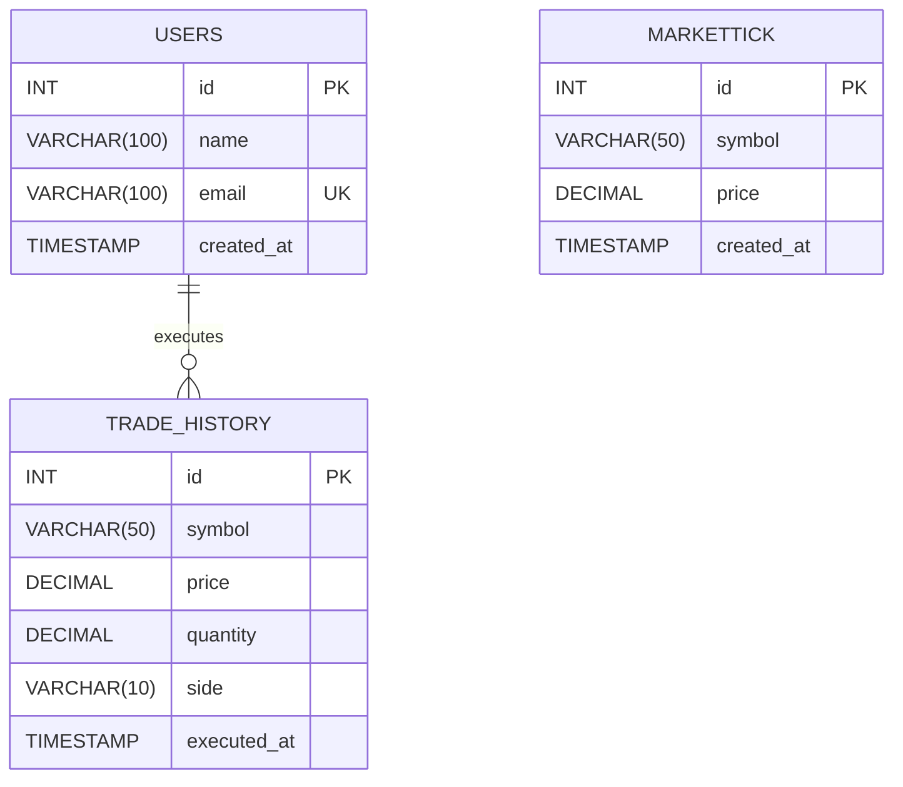

# 🗄 DATABASE SCHEMA DOCUMENTATION
## Limit Order Book & Trade Execution System

This document outlines the relational data structure required for the LOB system. While the current development environment uses a thread-safe in-memory mock, the following schema is designed for a **PostgreSQL** production deployment.

---

## 🏗 ENTITY RELATIONSHIP DIAGRAM (ERD)



### Visual Architecture (Relational ERD)


---

## 📋 TABLE DEFINITIONS

### 1. `markettick`
This table stores raw ingestion data from the Finnhub WebSocket feed. It is optimized for high-frequency writes.

| Field | Type | Constraint | Description |
| :--- | :--- | :--- | :--- |
| **id** | `INT` | **PRIMARY KEY** | Unique identifier for each tick. |
| **symbol** | `VARCHAR(50)` | `NOT NULL` | The trading pair (e.g., BINANCE:BTCUSDT). |
| **price** | `DECIMAL(18, 8)` | `NOT NULL` | The current market price. |
| **created_at**| `TIMESTAMP` | `DEFAULT NOW()` | The exact time of ingestion. |

### 2. `users`
Stores user profile information for authentication and profile management.

| Field | Type | Constraint | Description |
| :--- | :--- | :--- | :--- |
| **id** | `INT` | **PRIMARY KEY** | Unique user ID. |
| **name** | `VARCHAR(100)`| `NOT NULL` | User full name. |
| **email** | `VARCHAR(100)`| **UNIQUE** | User email address. |
| **created_at**| `TIMESTAMP` | `DEFAULT NOW()` | Date and time the user account was created. |

### 3. `trade_history` (Future Implementation)
Designed to store realized executions for reporting and P&L calculations.

| Field | Type | Constraint | Description |
| :--- | :--- | :--- | :--- |
| **id** | `INT` | **PRIMARY KEY** | Unique execution ID. |
| **symbol** | `VARCHAR(50)` | `NOT NULL` | The asset traded. |
| **price** | `DECIMAL(18, 8)` | `NOT NULL` | The price at which the trade occurred. |
| **quantity** | `DECIMAL(18, 8)` | `NOT NULL` | Amount traded. |
| **side** | `VARCHAR(10)` | `CHECK (side IN ('BUY', 'SELL'))` | Execution direction. |
| **executed_at**| `TIMESTAMP` | `DEFAULT NOW()` | Execution timestamp. |

---

## 🛠 SQL SCHEMA REFERENCE

```sql
CREATE DATABASE IF NOT EXISTS hft_trading;
USE hft_trading;

-- Create users table
CREATE TABLE users (
    id INT AUTO_INCREMENT PRIMARY KEY,
    name VARCHAR(100),
    email VARCHAR(100) UNIQUE,
    created_at TIMESTAMP DEFAULT CURRENT_TIMESTAMP
);

-- Create markettick table
CREATE TABLE markettick (
    id INT AUTO_INCREMENT PRIMARY KEY,
    symbol VARCHAR(50) NOT NULL,
    price DECIMAL(18, 8) NOT NULL,
    created_at TIMESTAMP DEFAULT CURRENT_TIMESTAMP
);

-- Create index for performance on price retrieval
CREATE INDEX idx_markettick_symbol_id ON markettick (symbol, id DESC);

-- Create trade_history table
CREATE TABLE trade_history (
    id INT AUTO_INCREMENT PRIMARY KEY,
    symbol VARCHAR(50) NOT NULL,
    price DECIMAL(18, 8) NOT NULL,
    quantity DECIMAL(18, 8) NOT NULL,
    side VARCHAR(10) CHECK (side IN ('BUY', 'SELL')),
    executed_at TIMESTAMP DEFAULT CURRENT_TIMESTAMP
);
```

---

> [!IMPORTANT]
> **Performance Optimization**: For high-frequency environments, it is recommended to use an index on `(symbol, id DESC)` to ensure that the `SELECT ... ORDER BY id DESC LIMIT 1` query used by the WebSocket router remains sub-millisecond.

> [!NOTE]
> The current system utilizes a **Mock Storage** in `database.py` which mirrors this schema in-memory to facilitate development without a local Postgres instance.
